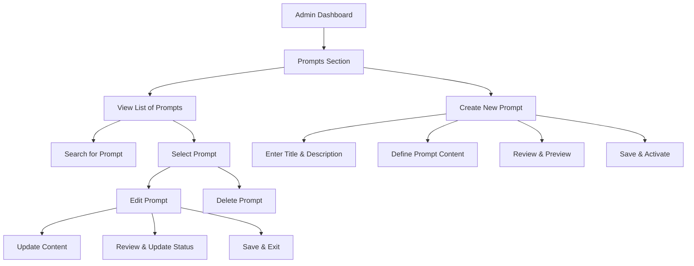

# Prompts
This is a roadmap for future prompt crafting planning

## Possible DB Scheme 

```sql
CREATE TABLE prompts (
    id SERIAL PRIMARY KEY,          -- Unique identifier for each prompt
    title VARCHAR(255) NOT NULL,    -- A short title or name for the prompt
    description TEXT,               -- A longer description or details about the prompt
    content TEXT NOT NULL,          -- The actual prompt content or question
    created_at TIMESTAMP DEFAULT CURRENT_TIMESTAMP, -- When the prompt was created
    updated_at TIMESTAMP DEFAULT CURRENT_TIMESTAMP, -- When the prompt was last updated
    is_active BOOLEAN DEFAULT TRUE, -- Whether the prompt is active or not (soft delete or toggle visibility)
    category VARCHAR(255),          -- Optional: Category or type of the prompt (e.g., "Fantasy", "Sci-Fi")
    author_id INT REFERENCES users(id), -- Optional: If you have a users table, to track who created the prompt
    -- Add any other columns that are relevant to your application's needs
);
```



